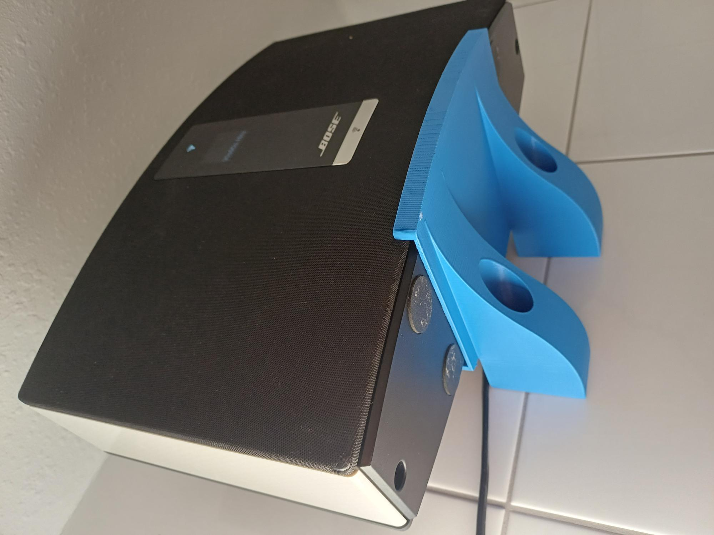
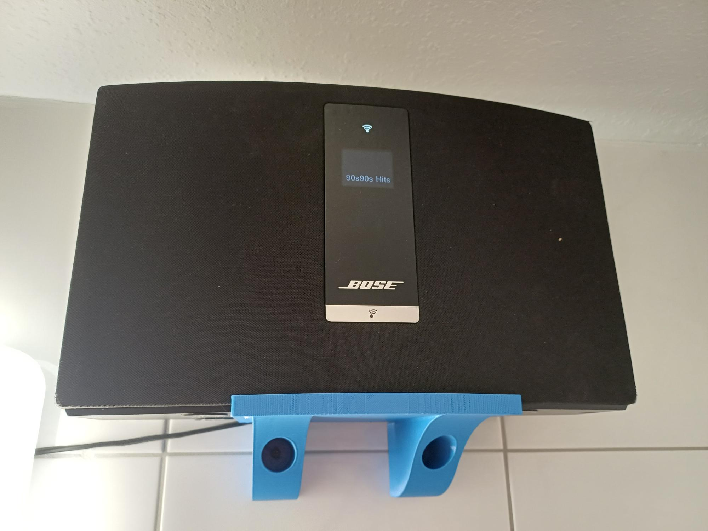
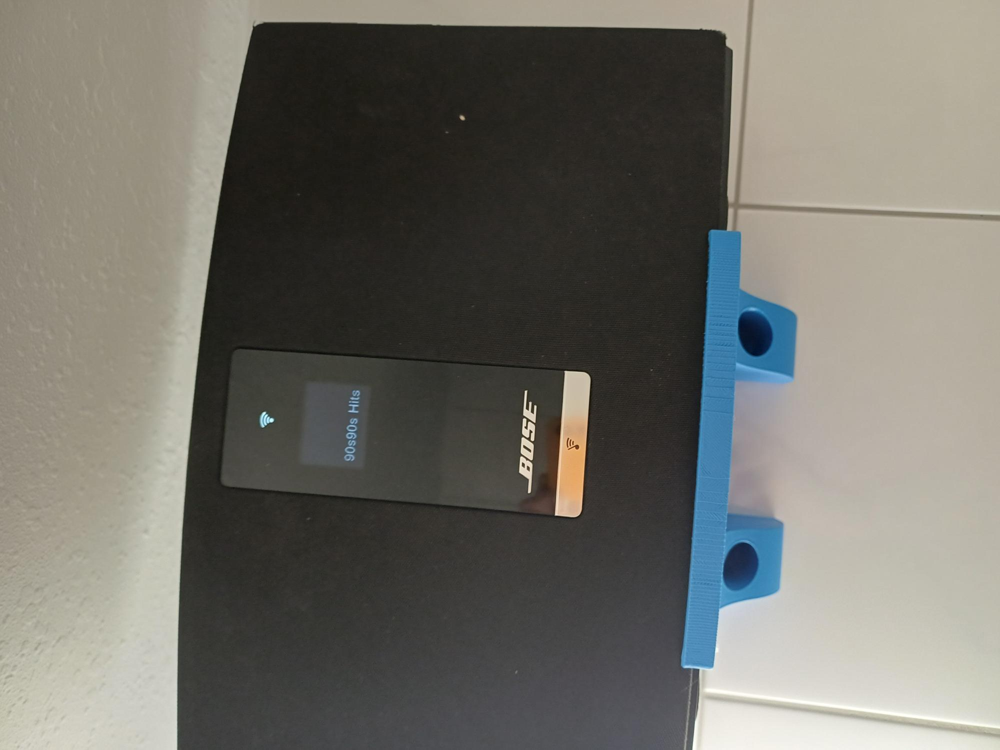

# Wall Mount for Bose SoundTouch 20

A 3D-printable wall mount designed for the Bose SoundTouch 20 (all generations).

**Author:** Sven Ipers  
**License:** Shared with permission for the OpenCloudTouch community

---

## Photos

| Side view | Front view | Full view |
|-----------|------------|-----------|
|  |  |  |

## Compatible Models

- Bose SoundTouch 20 (Series I, II, III)
- Mounting holes are identical to the original SoundTouch 10 wall bracket — can be used as a direct replacement

## Mounting

- **Type:** Wall / under-cabinet / ceiling mount
- **Screws:** 4–6 mm screws (mounting holes are self-centering)
- **Hole spacing:** Identical to the original Bose SoundTouch 10 bracket

## Print Settings

| Parameter | Recommendation |
|-----------|---------------|
| **Material** | PLA or PETG |
| **Infill** | 15–20%, crosshatch pattern |
| **Support** | Yes — tree support recommended if printed upright |
| **Orientation** | Normal or vertical |

## Download

- [`st20-wall-mount.stl`](st20-wall-mount.stl) — ready-to-print STL file

## Modifications

For custom modifications or requests, contact the author.
