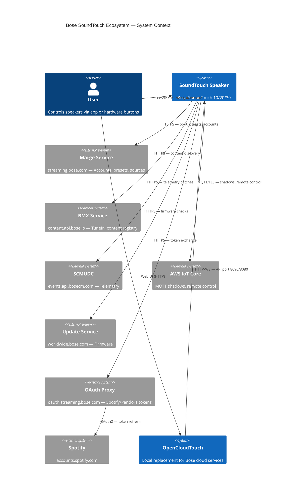
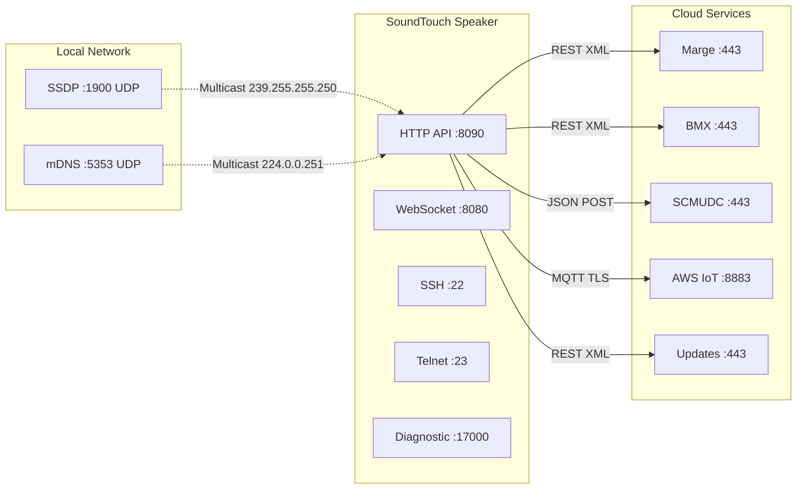

# Process Overview — Bose SoundTouch Ecosystem

All major processes in the Bose SoundTouch ecosystem, visualized.

## Process Index

| # | Process | Description | Diagram |
|---|---------|-------------|---------|
| 1 | [Device Discovery](61-process-device-discovery.md) | SSDP/mDNS → `/info` enrichment | Sequence |
| 2 | [Device Boot & Registration](62-process-device-boot.md) | Power-on → cloud call-in → source availability | Sequence |
| 3 | [Preset Lifecycle](63-process-preset-lifecycle.md) | Read / Store / Remove / Select presets | Sequence |
| 4 | [Zone Management](64-process-zone-management.md) | Create / Add / Remove / Dissolve multiroom zones | Sequence |
| 5 | [Spotify Account Flow](65-process-spotify-account.md) | OAuth → cloud registration → device sync | Sequence |
| 6 | [Device Migration](66-process-device-migration.md) | Redirect → CA injection → reboot → verify | Sequence |
| 7 | [Device Access (SSH)](67-process-device-access.md) | USB stick → enable SSH → connect | Sequence |
| 8 | [WebSocket Monitoring](68-process-websocket-monitoring.md) | Connect → subscribe → event handling | Sequence |
| 9 | [IoT MQTT Communication](69-process-iot-mqtt.md) | Certificate → MQTT → Device Shadows | Sequence |
| 10 | [Telemetry (SCMUDC)](70-process-telemetry.md) | Device events → JSON batches → cloud | Sequence |

## System Context Diagram

## Communication Ports

