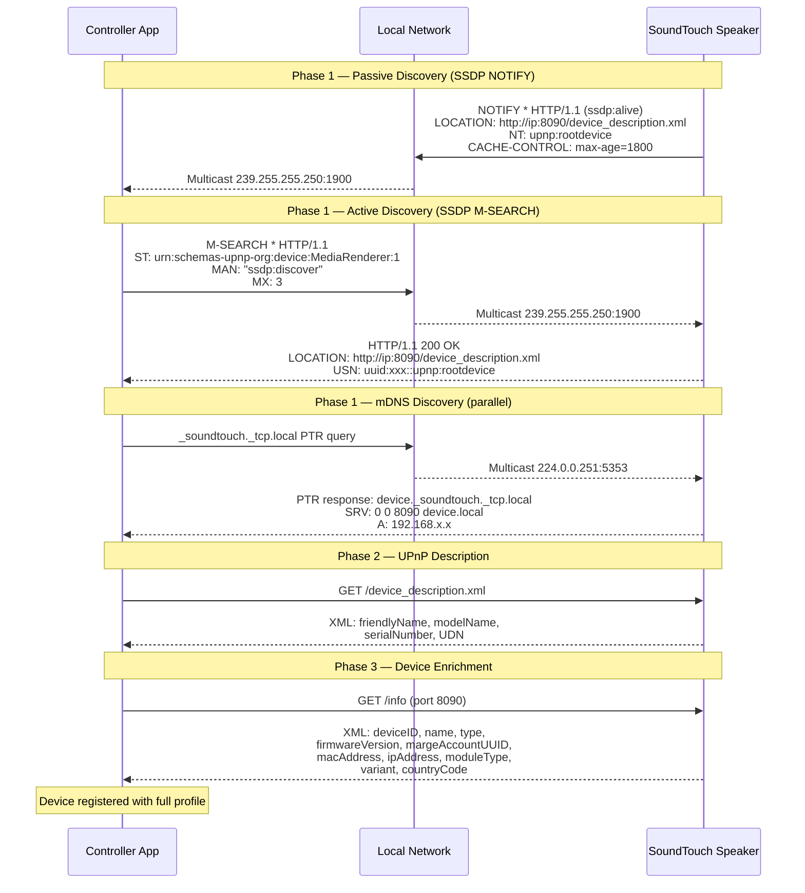
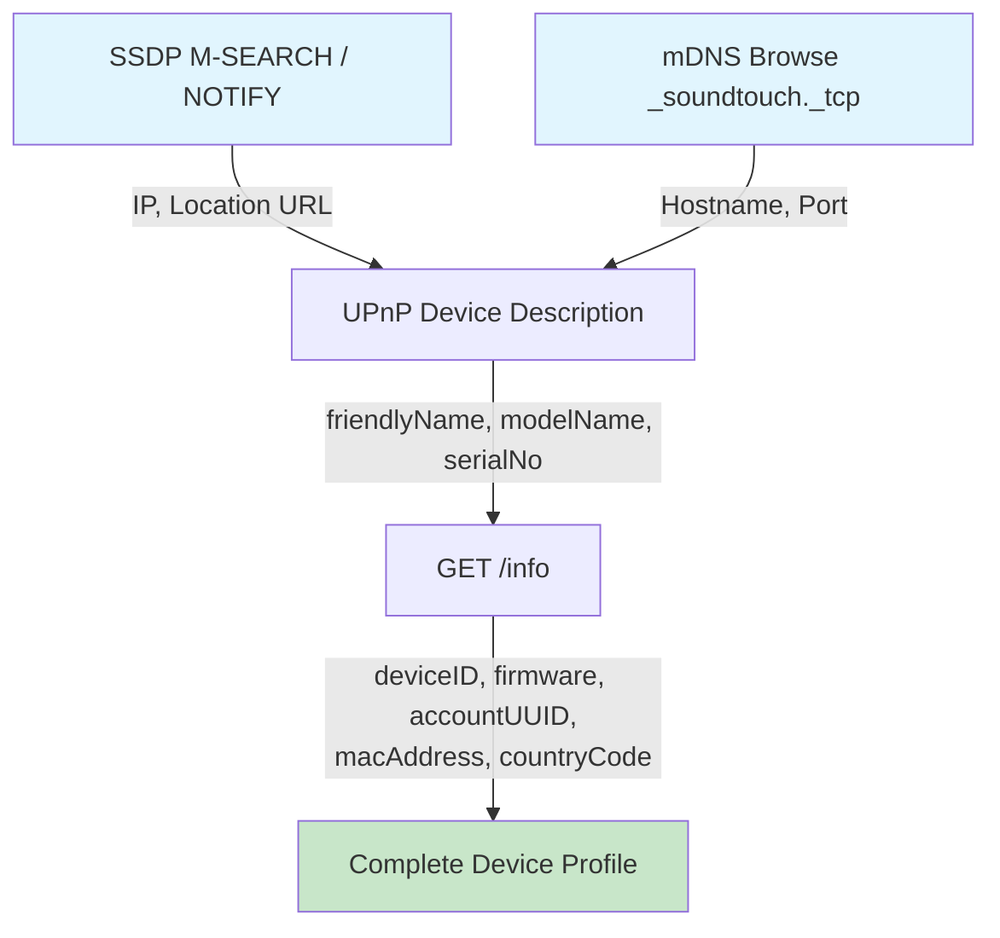

# Process: Device Discovery

How SoundTouch devices are found on the local network.

## Sequence Diagram

## Data Flow

## Collected Data per Phase

| Field | SSDP/mDNS | UPnP XML | GET /info |
|-------|:---------:|:--------:|:---------:|
| IP Address | ✅ | ✅ | ✅ |
| Port (8090) | ✅ | — | — |
| Device Name | — | ✅ | ✅ |
| Model | — | ✅ | ✅ |
| MAC / Serial | — | ✅ | ✅ |
| Firmware | — | — | ✅ |
| Account UUID | — | — | ✅ |
| Country Code | — | — | ✅ |
| Module Type | — | — | ✅ |
