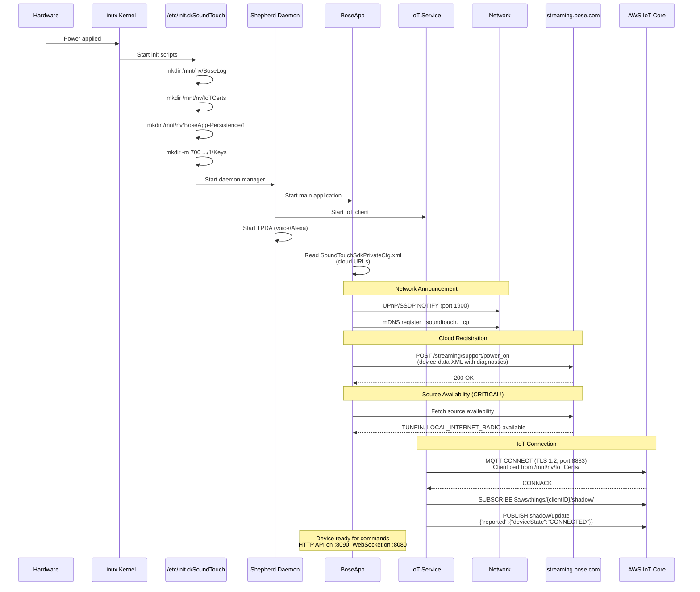
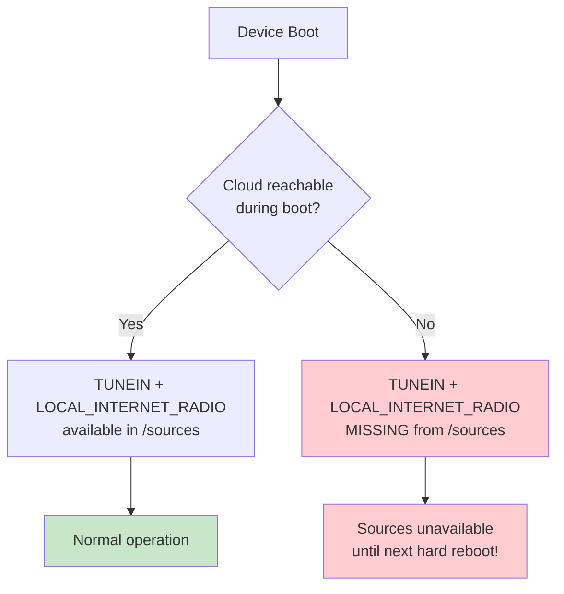
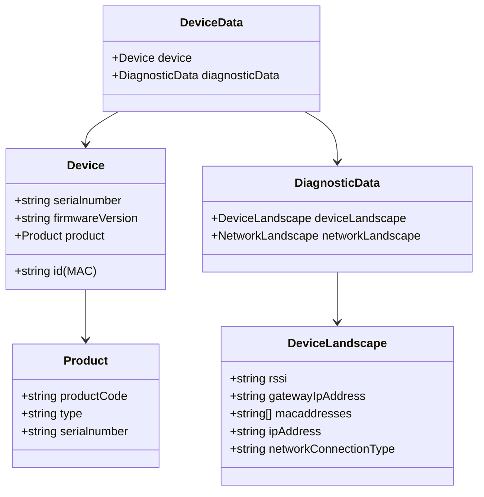

# Process: Device Boot & Registration

What happens when a SoundTouch device powers on (hard boot, not standby).

## Boot Sequence

## Critical: Source Availability at Boot

## /power_on Request Content

