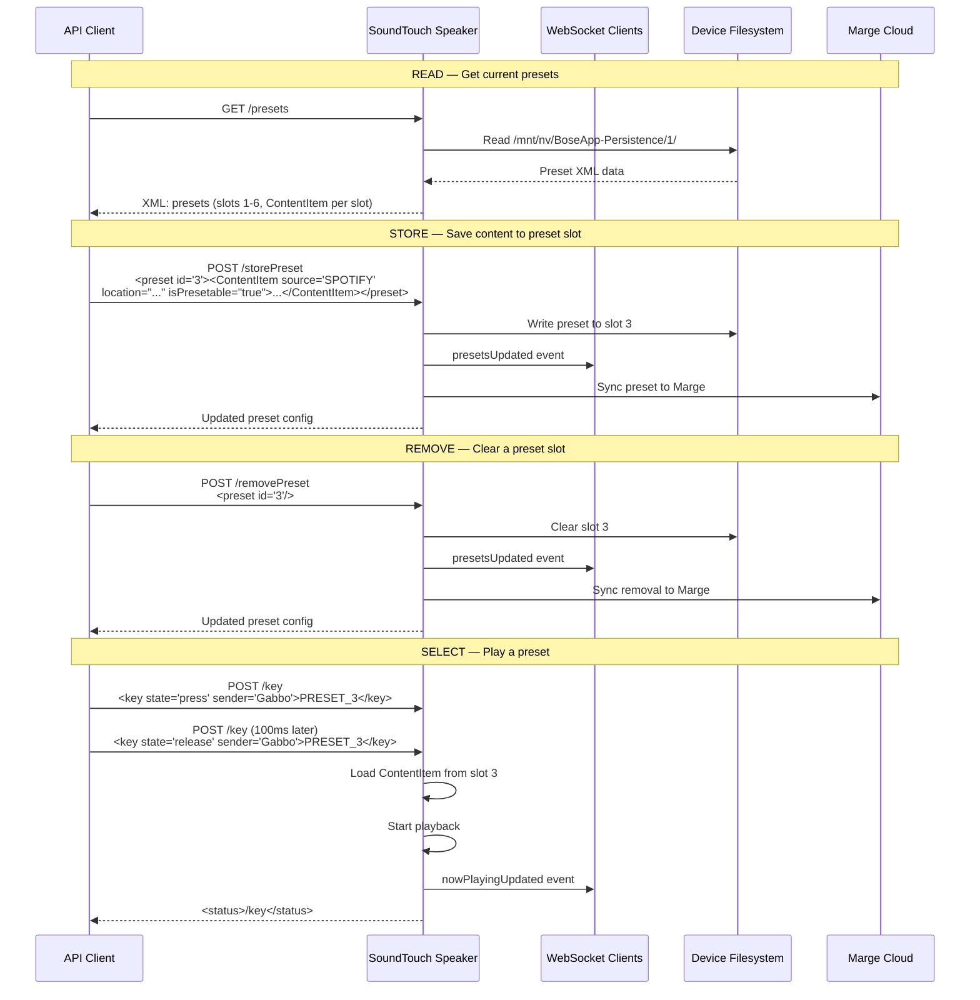
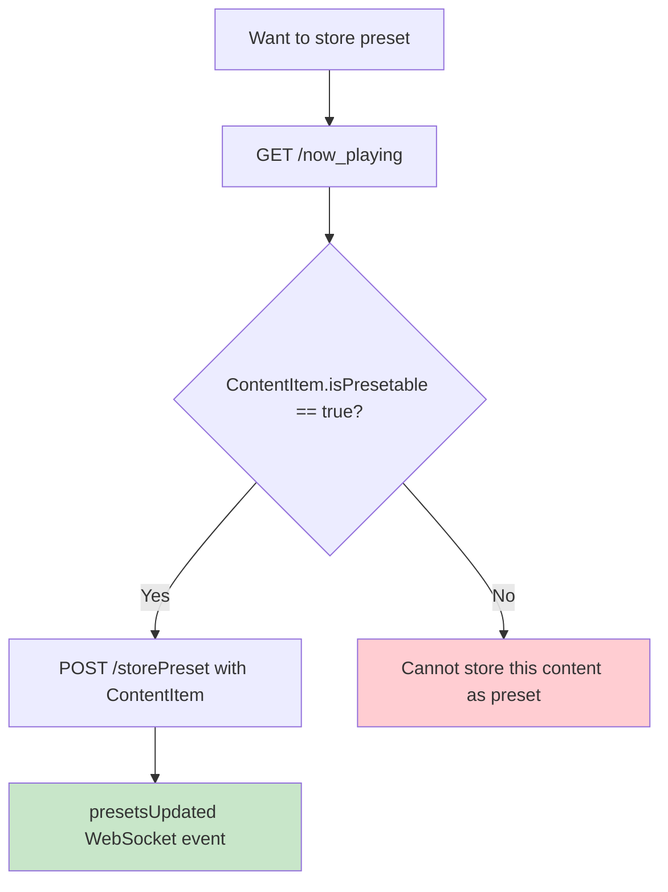
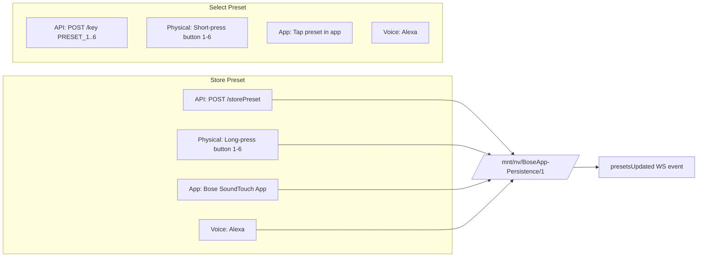
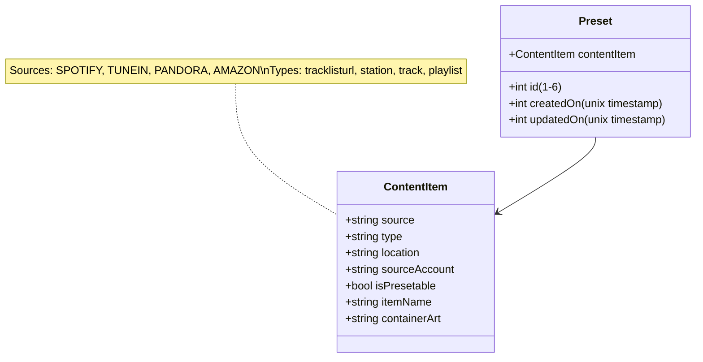

# Process: Preset Lifecycle

Read, Store, Remove, and Select presets (slots 1–6).

## Complete Preset Flow

```mermaid
sequenceDiagram
    participant Client as API Client
    participant ST as SoundTouch Speaker
    participant WS as WebSocket Clients
    participant FS as Device Filesystem
    participant Cloud as Marge Cloud

    Note over Client,Cloud: READ — Get current presets
    Client->>ST: GET /presets
    ST->>FS: Read /mnt/nv/BoseApp-Persistence/1/
    FS-->>ST: Preset XML data
    ST-->>Client: XML: presets (slots 1-6, ContentItem per slot)

    Note over Client,Cloud: STORE — Save content to preset slot
    Client->>ST: POST /storePreset<br/><preset id="3"><ContentItem source="SPOTIFY"<br/>location="..." isPresetable="true">...</ContentItem></preset>
    ST->>FS: Write preset to slot 3
    ST->>WS: presetsUpdated event
    ST->>Cloud: Sync preset to Marge
    ST-->>Client: Updated preset config

    Note over Client,Cloud: REMOVE — Clear a preset slot
    Client->>ST: POST /removePreset<br/><preset id="3"/>
    ST->>FS: Clear slot 3
    ST->>WS: presetsUpdated event
    ST->>Cloud: Sync removal to Marge
    ST-->>Client: Updated preset config

    Note over Client,Cloud: SELECT — Play a preset
    Client->>ST: POST /key<br/><key state="press" sender="Gabbo">PRESET_3</key>
    Client->>ST: POST /key (100ms later)<br/><key state="release" sender="Gabbo">PRESET_3</key>
    ST->>ST: Load ContentItem from slot 3
    ST->>ST: Start playback
    ST->>WS: nowPlayingUpdated event
    ST-->>Client: <status>/key</status>
```

## Presetability Check

```mermaid
flowchart TD
    A[Want to store preset] --> B[GET /now_playing]
    B --> C{ContentItem.isPresetable == true?}
    C -->|Yes| D[POST /storePreset with ContentItem]
    C -->|No| E[Cannot store this content as preset]
    D --> F[presetsUpdated WebSocket event]

    style E fill:#ffcdd2
    style F fill:#c8e6c9
```

## Preset Storage Methods

```mermaid
flowchart LR
    subgraph "Store Preset"
        A[API: POST /storePreset]
        B[Physical: Long-press button 1-6]
        C[App: Bose SoundTouch App]
        D[Voice: Alexa]
    end

    subgraph "Select Preset"
        E[API: POST /key PRESET_1..6]
        F[Physical: Short-press button 1-6]
        G[App: Tap preset in app]
        H[Voice: Alexa]
    end

    A --> I[/mnt/nv/BoseApp-Persistence/1/]
    B --> I
    C --> I
    D --> I
    I --> J[presetsUpdated WS event]
```

## ContentItem Structure

```mermaid
classDiagram
    class Preset {
        +int id (1-6)
        +int createdOn (unix timestamp)
        +int updatedOn (unix timestamp)
        +ContentItem contentItem
    }
    class ContentItem {
        +string source
        +string type
        +string location
        +string sourceAccount
        +bool isPresetable
        +string itemName
        +string containerArt
    }
    Preset --> ContentItem

    note for ContentItem "Sources: SPOTIFY, TUNEIN, PANDORA, AMAZON\nTypes: tracklisturl, station, track, playlist"
```
