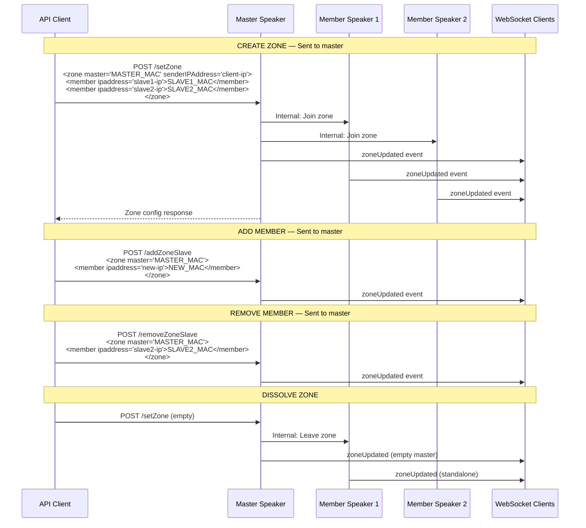
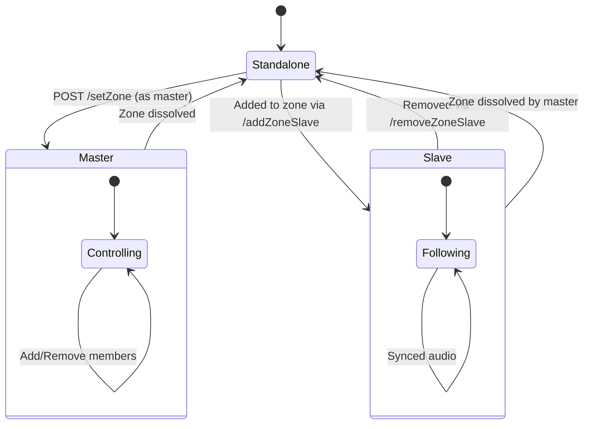

# Process: Zone Management (Multiroom)

Create, modify, and dissolve multiroom zones.

## Zone Lifecycle



## Zone States



## Zone Audio Routing

```mermaid
flowchart TD
    subgraph Zone
        M[Master Speaker<br/>Controls playback] --> |Synced audio| S1[Member 1]
        M --> |Synced audio| S2[Member 2]
        M --> |Synced audio| S3[Member 3]
    end

    Client[API Client] --> |POST /key, /volume, /select| M
    Client -.-> |GET /getZone| M
    Client -.x |Commands ignored| S1
    Client -.x |Commands ignored| S2

    style M fill:#bbdefb
    style S1 fill:#e1f5fe
    style S2 fill:#e1f5fe
    style S3 fill:#e1f5fe
```

## Constraints

- Max ~6 devices per zone
- All devices must be on same network segment
- Only master accepts playback commands
- No authentication — any LAN client can manage zones
- Zone operations may take several seconds
