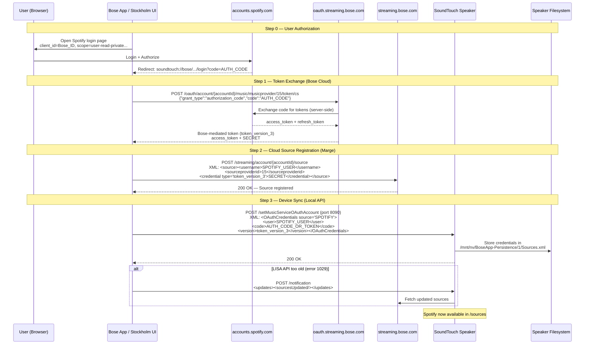
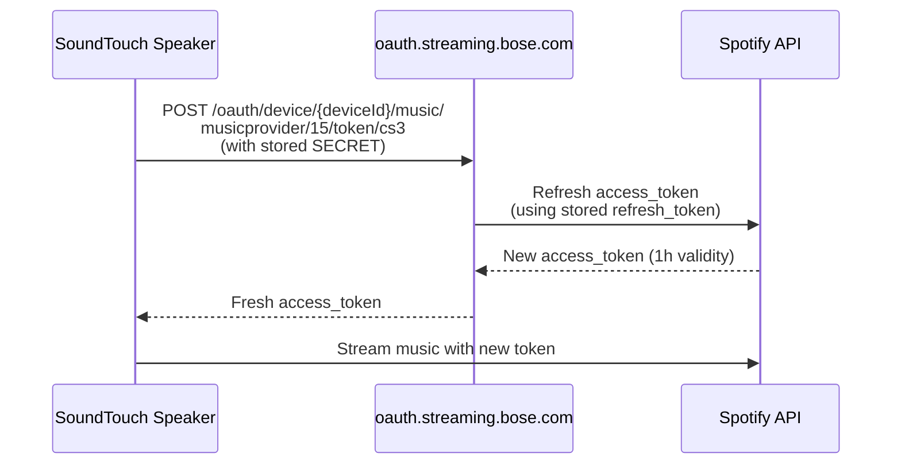
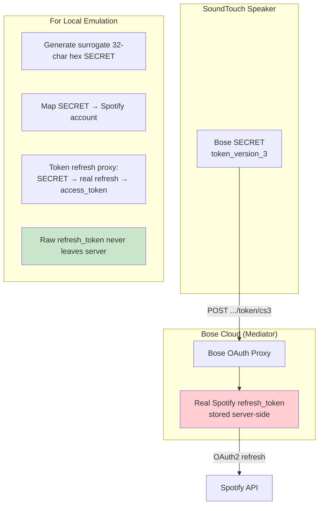

# Process: Spotify Account Addition

Full OAuth flow to add Spotify to a SoundTouch device.

## Complete Flow

## Token Refresh Flow (Runtime)

## Token Architecture

## Constants

| Value | Meaning |
|-------|---------|
| `15` | Spotify `sourceproviderid` |
| `token_version_3` | Modern OAuth credential type |
| `soundtouch://bose/...` | Deep link redirect URI |
| `http://localhost` | OAuth redirect URI |
