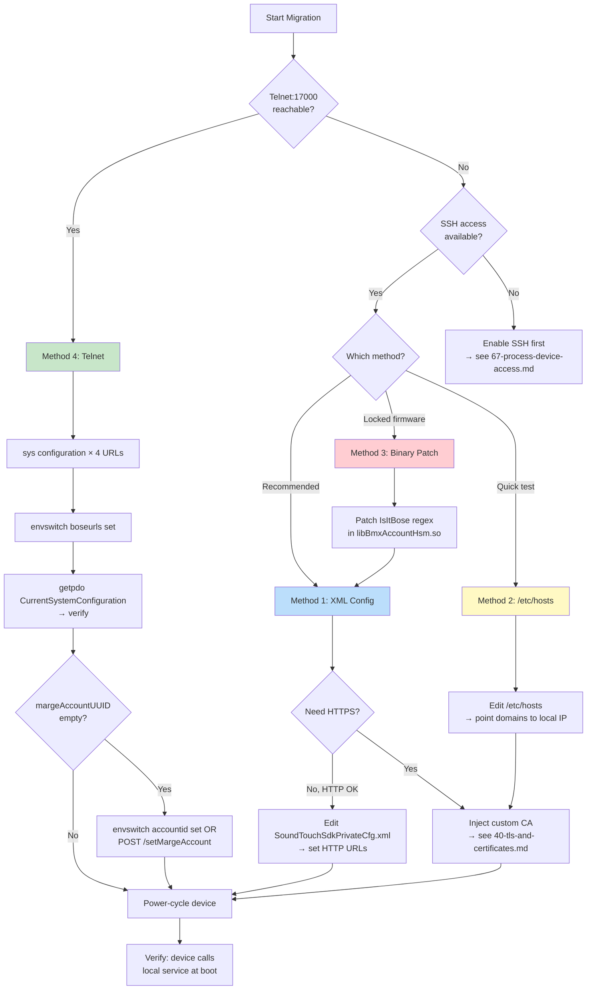
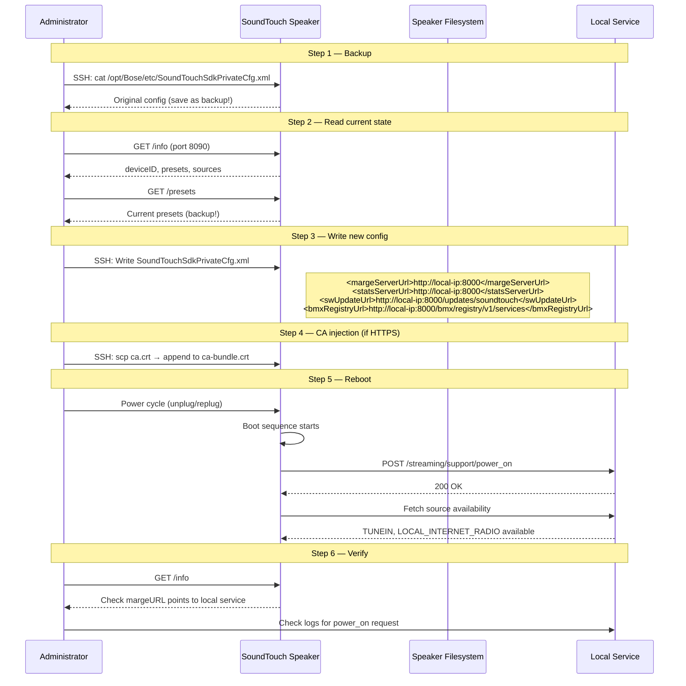
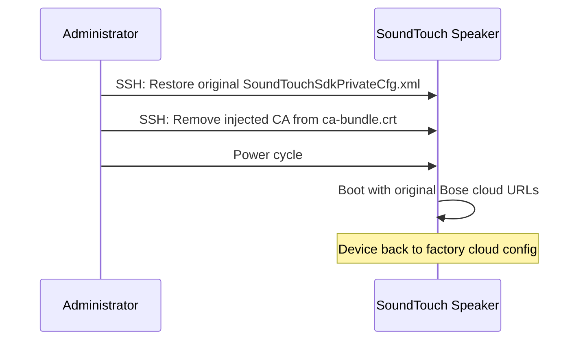
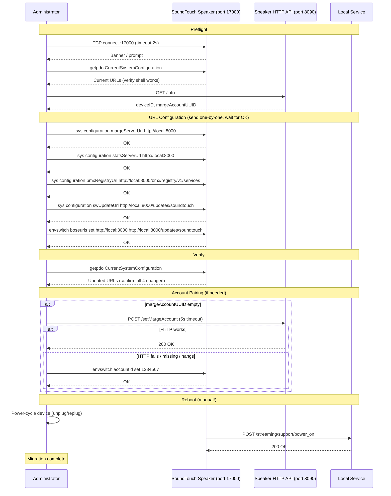
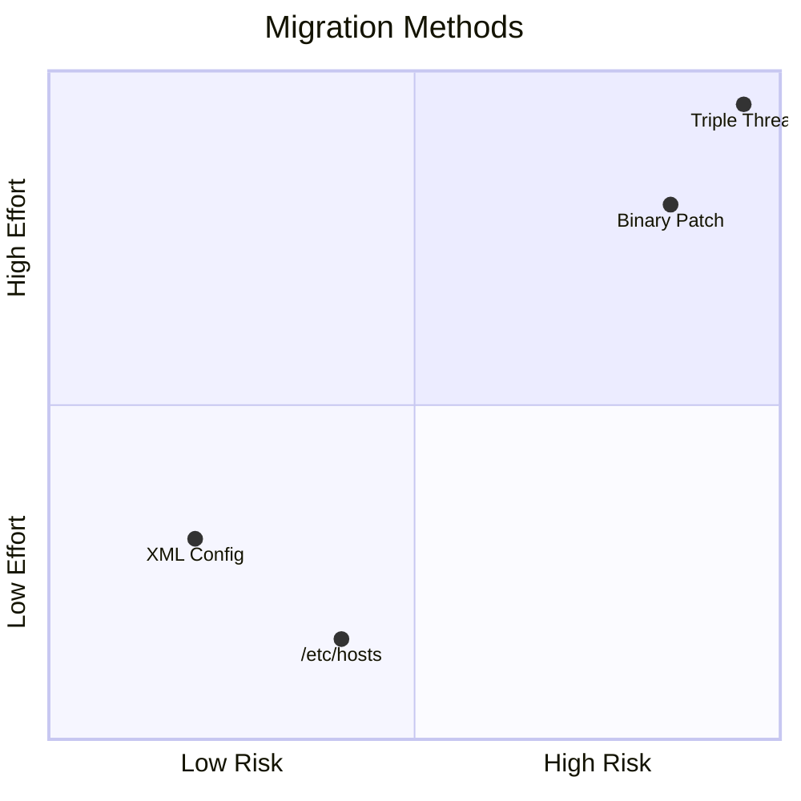

# Process: Device Migration

Redirecting a SoundTouch device from Bose Cloud to a local service.

## Migration Decision Tree

## XML Config Migration (Method 1)

## Rollback

## Telnet:17000 Migration (Method 4 — No SSH)

## Method Comparison

