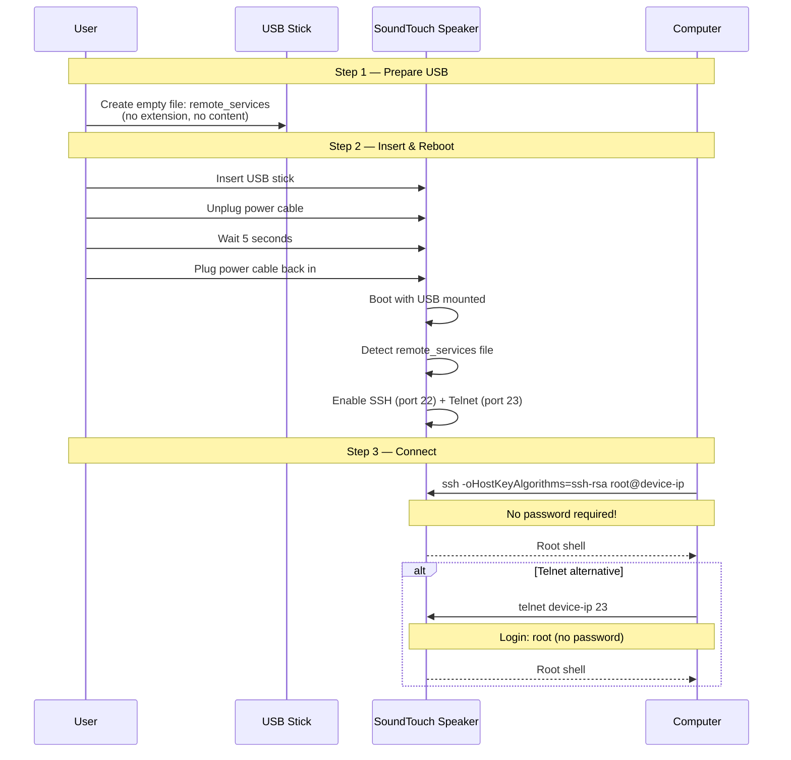
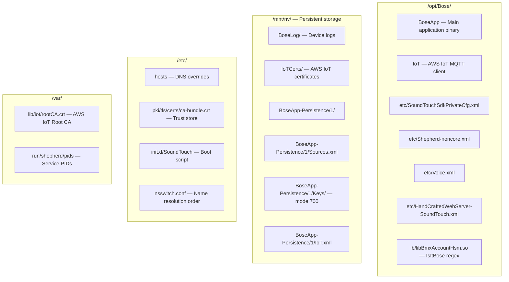
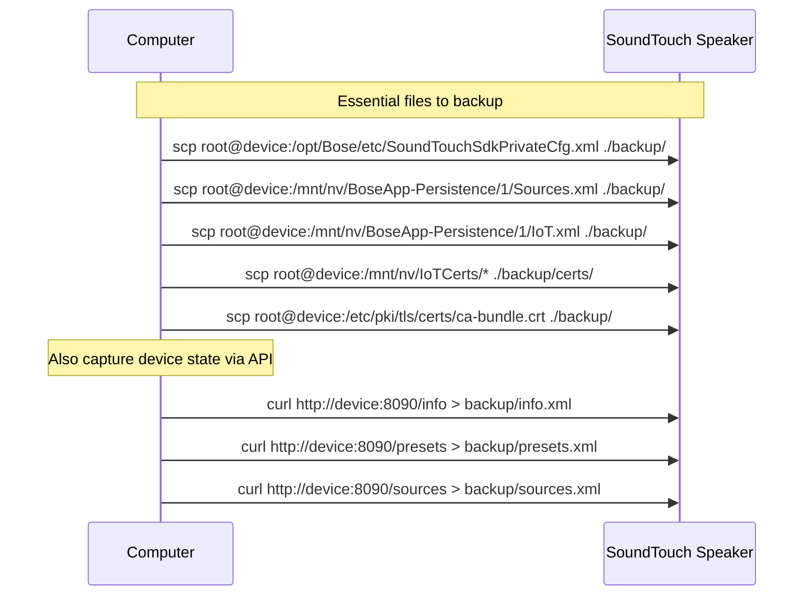

# Process: Device Access (SSH/Telnet)

Gaining root access to a SoundTouch device via USB stick.

## Enable SSH Flow

```mermaid
sequenceDiagram
    participant User as User
    participant USB as USB Stick
    participant ST as SoundTouch Speaker
    participant PC as Computer

    Note over User,PC: Step 1 — Prepare USB
    User->>USB: Create empty file: remote_services<br/>(no extension, no content)

    Note over User,PC: Step 2 — Insert & Reboot
    User->>ST: Insert USB stick
    User->>ST: Unplug power cable
    User->>ST: Wait 5 seconds
    User->>ST: Plug power cable back in
    ST->>ST: Boot with USB mounted
    ST->>ST: Detect remote_services file
    ST->>ST: Enable SSH (port 22) + Telnet (port 23)

    Note over User,PC: Step 3 — Connect
    PC->>ST: ssh -oHostKeyAlgorithms=ssh-rsa root@device-ip
    Note over PC,ST: No password required!
    ST-->>PC: Root shell

    alt Telnet alternative
        PC->>ST: telnet device-ip 23
        Note over PC,ST: Login: root (no password)
        ST-->>PC: Root shell
    end
```

## Filesystem Layout

```mermaid
graph TD
    subgraph "/opt/Bose/"
        A[BoseApp — Main application binary]
        B[IoT — AWS IoT MQTT client]
        C[etc/SoundTouchSdkPrivateCfg.xml]
        D[etc/Shepherd-noncore.xml]
        E[etc/Voice.xml]
        F[etc/HandCraftedWebServer-SoundTouch.xml]
        G[lib/libBmxAccountHsm.so — IsItBose regex]
    end

    subgraph "/mnt/nv/ — Persistent storage"
        H[BoseLog/ — Device logs]
        I[IoTCerts/ — AWS IoT certificates]
        J[BoseApp-Persistence/1/]
        K[BoseApp-Persistence/1/Sources.xml]
        L[BoseApp-Persistence/1/Keys/ — mode 700]
        M[BoseApp-Persistence/1/IoT.xml]
    end

    subgraph "/etc/"
        N[hosts — DNS overrides]
        O[pki/tls/certs/ca-bundle.crt — Trust store]
        P[init.d/SoundTouch — Boot script]
        Q[nsswitch.conf — Name resolution order]
    end

    subgraph "/var/"
        R[lib/iot/rootCA.crt — AWS IoT Root CA]
        S[run/shepherd/pids — Service PIDs]
    end
```

## Backup Procedure

```mermaid
sequenceDiagram
    participant PC as Computer
    participant ST as SoundTouch Speaker

    Note over PC,ST: Essential files to backup
    PC->>ST: scp root@device:/opt/Bose/etc/SoundTouchSdkPrivateCfg.xml ./backup/
    PC->>ST: scp root@device:/mnt/nv/BoseApp-Persistence/1/Sources.xml ./backup/
    PC->>ST: scp root@device:/mnt/nv/BoseApp-Persistence/1/IoT.xml ./backup/
    PC->>ST: scp root@device:/mnt/nv/IoTCerts/* ./backup/certs/
    PC->>ST: scp root@device:/etc/pki/tls/certs/ca-bundle.crt ./backup/

    Note over PC: Also capture device state via API
    PC->>ST: curl http://device:8090/info > backup/info.xml
    PC->>ST: curl http://device:8090/presets > backup/presets.xml
    PC->>ST: curl http://device:8090/sources > backup/sources.xml
```
