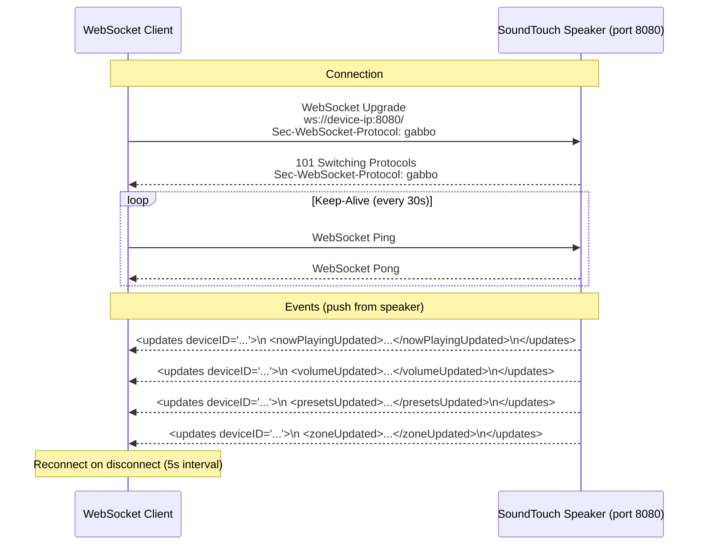
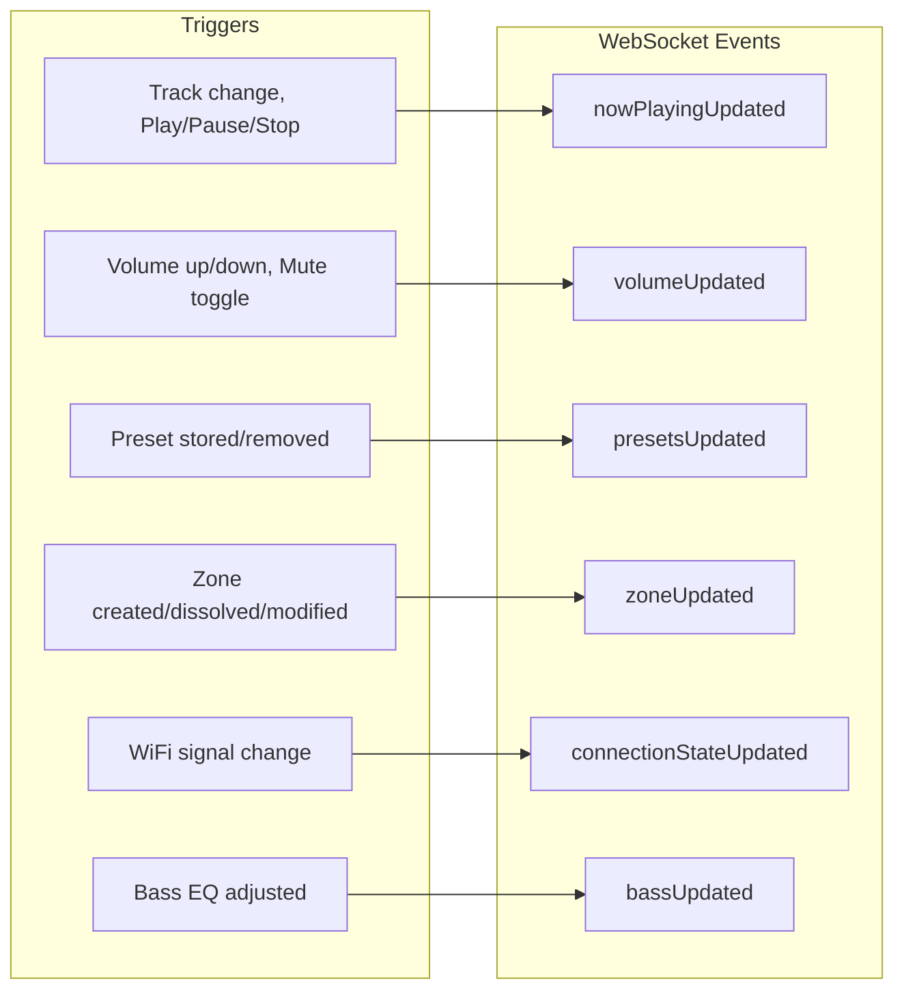
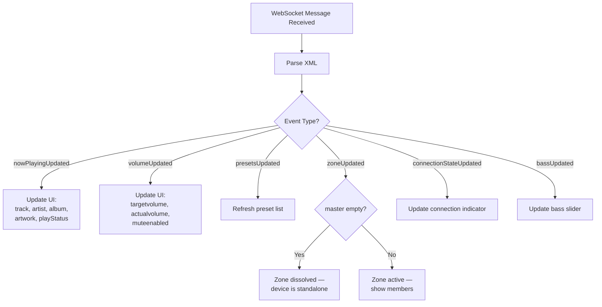

# Process: WebSocket Monitoring

Real-time event monitoring via WebSocket on port 8080.

## Connection & Event Flow

## Event Types

## Event Processing

## Connection Parameters

| Parameter | Value |
|-----------|-------|
| Protocol | `ws://` (unencrypted) |
| Port | 8080 |
| Path | `/` |
| Sub-Protocol | `gabbo` |
| Auth | None |
| Ping interval | 30 seconds |
| Pong timeout | 10 seconds |
| Reconnect interval | 5 seconds |
| Buffer size | 1024–2048 bytes |
