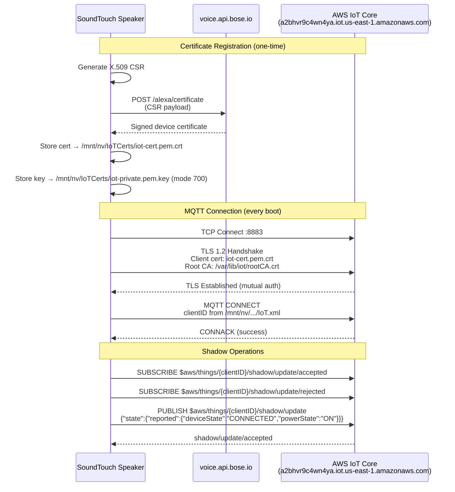
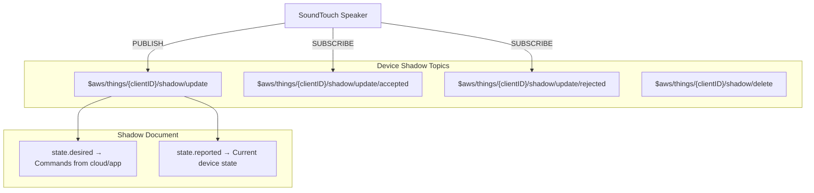
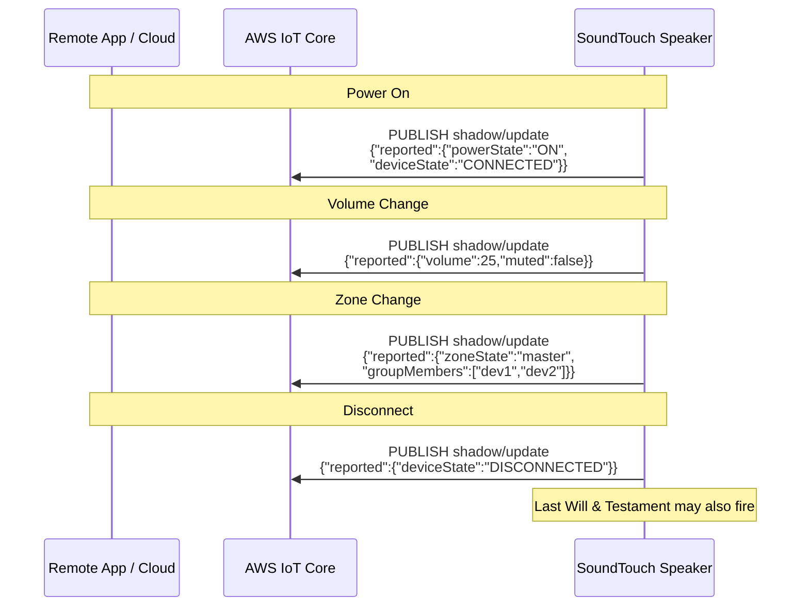
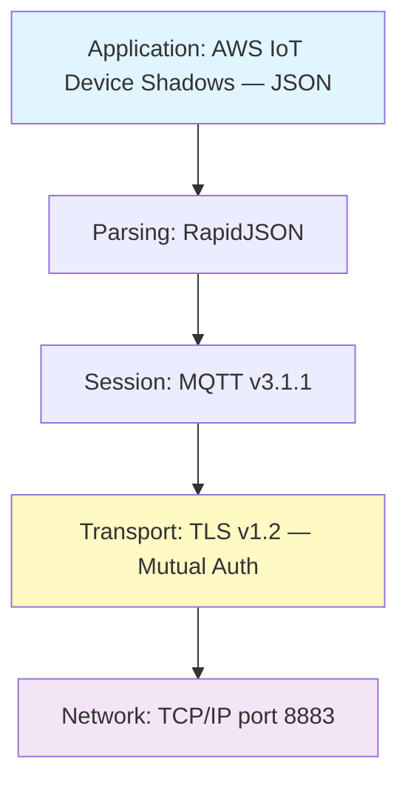

# Process: IoT MQTT Communication

AWS IoT Core connection for remote device management.

## Certificate Registration & MQTT Connection

## MQTT Topic Structure

## Shadow State Changes

## Protocol Stack

## IoT Configuration Files

| File | Path | Content |
|------|------|---------|
| IoT.xml | `/mnt/nv/BoseApp-Persistence/1/` | clientID (UUID), iotEndpoint, deployment |
| iot-cert.pem.crt | `/mnt/nv/IoTCerts/` | Device client certificate |
| iot-private.pem.key | `/mnt/nv/IoTCerts/` | Device private key (mode 700) |
| rootCA.crt | `/var/lib/iot/` | AWS IoT Root CA |
| Shepherd-noncore.xml | `/opt/Bose/etc/` | IoT service configuration |
