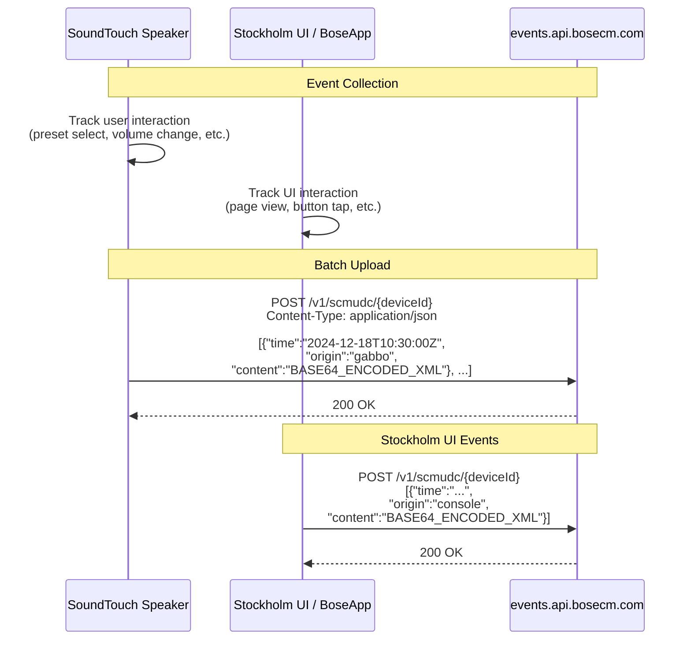
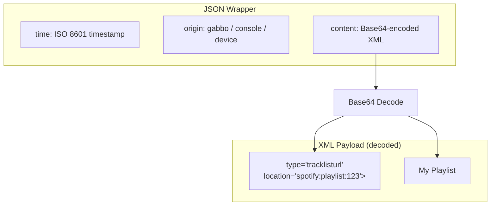
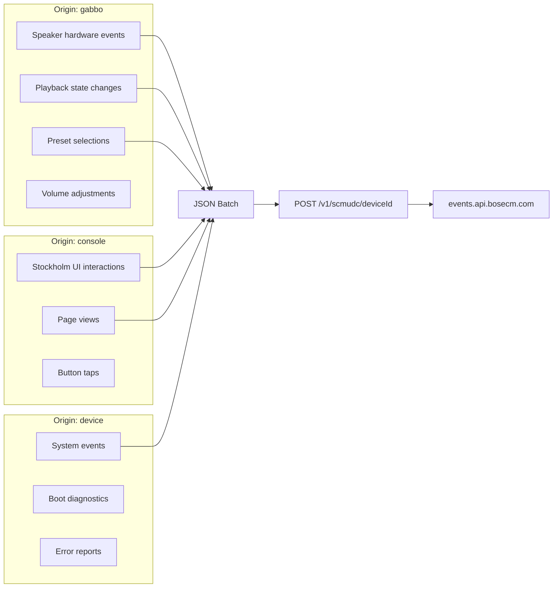

# Process: SCMUDC Telemetry

Device analytics and telemetry reporting to Bose cloud.

## Telemetry Flow



## Event Structure



## Event Origins



## For Local Emulation

```mermaid
flowchart TD
    A[Device sends POST /v1/scmudc/{deviceId}] --> B[Local service receives JSON batch]
    B --> C{Process or ignore?}
    C -->|Minimum| D[Return 200 OK<br/>Device satisfied, no retries]
    C -->|Optional| E[Base64-decode content field<br/>Parse XML payload<br/>Store for analytics]

    style D fill:#c8e6c9
    style E fill:#e1f5fe
```

The telemetry endpoint is **low priority** for cloud emulation. A simple `200 OK` response satisfies the device and prevents retry loops. The actual telemetry data is only useful for analytics and debugging.
